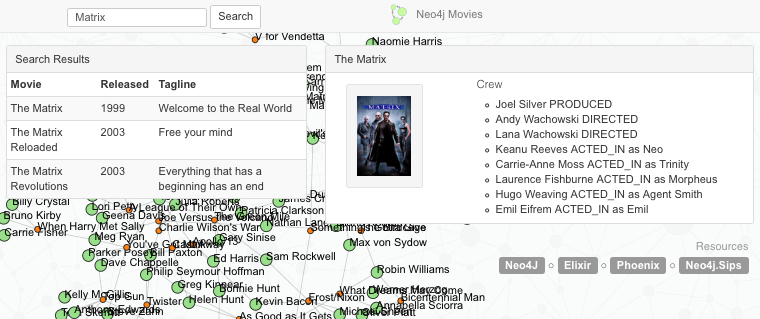

## The Movies Example Application

A very simple web application using [Neo4j](http://neo4j.com/developer/get-started/) with [Elixir](http://elixir-lang.org), [Phoenix](http://www.phoenixframework.org) and [Neo4j.Sips(β)](https://github.com/florinpatrascu/neo4j_sips).

### The Stack

These are the components of our Web Application:

- Application Type: An [Elixir](http://elixir-lang.org) [Phoenix](http://www.phoenixframework.org) web application
- Web framework: [Phoenix](http://www.phoenixframework.org)
- Persistence Access: [Neo4j.Sips(β)](https://github.com/florinpatrascu/neo4j_sips)
- Database: [Neo4j](http://neo4j.com/developer/get-started/) Server with Movies dataset
- Frontend: jquery, bootstrap

### Prerequisites

- elixir and phoenix
- a local (or remote) Neo4j graph database server. This demo will connect to a local Neo4j Community Edition server instance available at: `http://localhost:7474` 
- disable auth in `conf/neo4j-server.properties` (for now)
- the demo Movie Database. Open the [Neo4j Browser](http://localhost:7474).
Then install the Movies dataset with `:play movies`, click and hit the "Run" button.

## Install

    $ git clone https://github.com/neo4j-examples/movies-elixir-phoenix
    $ cd movies-elixir-phoenix
    $ mix do deps.get, deps.compile

### Configure the access to your Neo4j server

Edit the `config/config.exs` and describe the Neo4j server endpoint, example:

    config :neo4j_sips, Neo4j,
      url: "http://localhost:7474",
      pool_size: 5,
      max_overflow: 2,
      timeout: 30

If your server requires basic authentication, add this to your config file:

    basic_auth: [username: "foo", password: "bar"]

or, if using a token, you can specify it like this: 

    token_auth: "bmVvNGo6O12kzdA=="

Sample configuration: 

    config :neo4j_sips, Neo4j,
      url: "http://localhost:7474",
      basic_auth: [username: "foo", password: "bar"],
      pool_size: 5,
      max_overflow: 2,
      timeout: 30

more details and examples, here: [Neo4j.Sips](https://github.com/florinpatrascu/neo4j_sips)

### Run

Start the Phoenix server:

    $ cd movies-elixir-phoenix
    $ mix phoenix.server

Point your browser to: `http://localhost:4000`, and you'll see something like this:

Oh, oh, and some **endpoints**, of course :)

    # JSON object for single movie with cast
    $ curl -H "Accept:application/json" \
      http://localhost:4000/movies/findByTitle?title=The%20Matrix

    # list of JSON objects for movie search results
    $ curl -H "Accept:application/json" \
      http://localhost:4000/movies/findByTitleContaining?title=matrix

### Credits

- using most of the UI from: [neo4j-examples/movies-java-spring-data-neo4j-4](https://github.com/neo4j-examples/movies-java-spring-data-neo4j-4). Thank you!

### License

MIT

